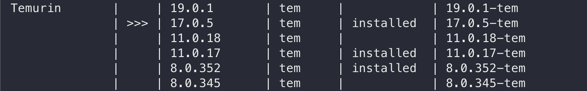
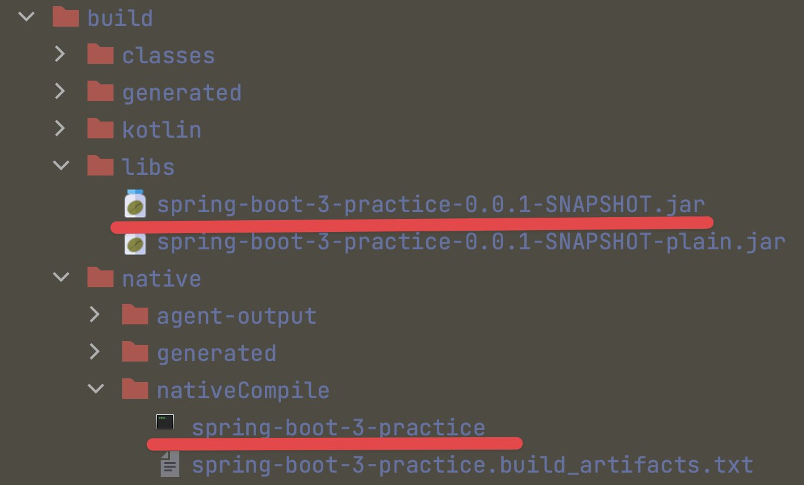
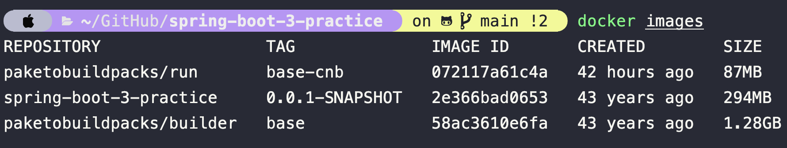
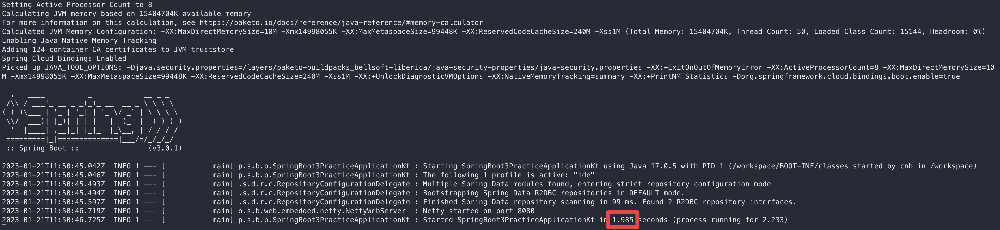
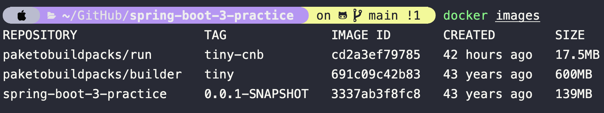

# spring-boot-3-practice
* Spring Boot 3
* Spring Framework 6
* Java 17
* Kotlin 1.7
* GraalVM 22

# SDKMAN!
* https://sdkman.io/
* install Java 17, GraalVM 22
```bash
sdk list java
sdk install java $version
```



* configure
```bash
export GRAALVM_HOME=<graalvm_directory>
export PATH=${GRAALVM_HOME}/bin:$PATH
```

# New Project


# Demo Java New Features
* records
  * https://github.com/PureFuncInc/Spring-Boot-3-Practice/blob/main/src/main/java/net/purefunc/spring/boot3/practice/java/JMemberPo.java#L12-L19
* text block
  * https://github.com/PureFuncInc/Spring-Boot-3-Practice/blob/main/src/main/java/net/purefunc/spring/boot3/practice/java/JMemberDao.java#L12-L21
* switch expression
  * https://github.com/PureFuncInc/Spring-Boot-3-Practice/blob/main/src/main/java/net/purefunc/spring/boot3/practice/java/JMemberPo.java#L25-L38 

# Build & Run
* build jar
```bash
./gradlew build
jar -jar libs/spring-boot-3-practice-0.0.1-SNAPSHOT.jar
```
* build native
```bash
./gradlew nativeCompile
./spring-boot-3-practice
```

* build OCI image
```bash
./gradlew bootBuildImage
docker run -d -p 8080:8080 spring-boot-3-practice:0.0.1-SNAPSHOT
```




