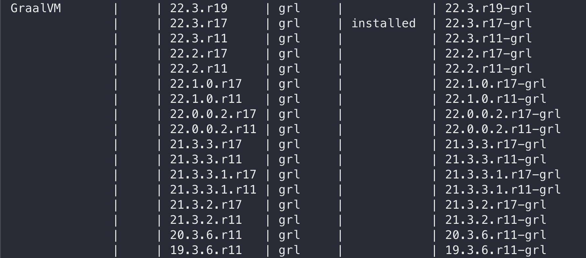
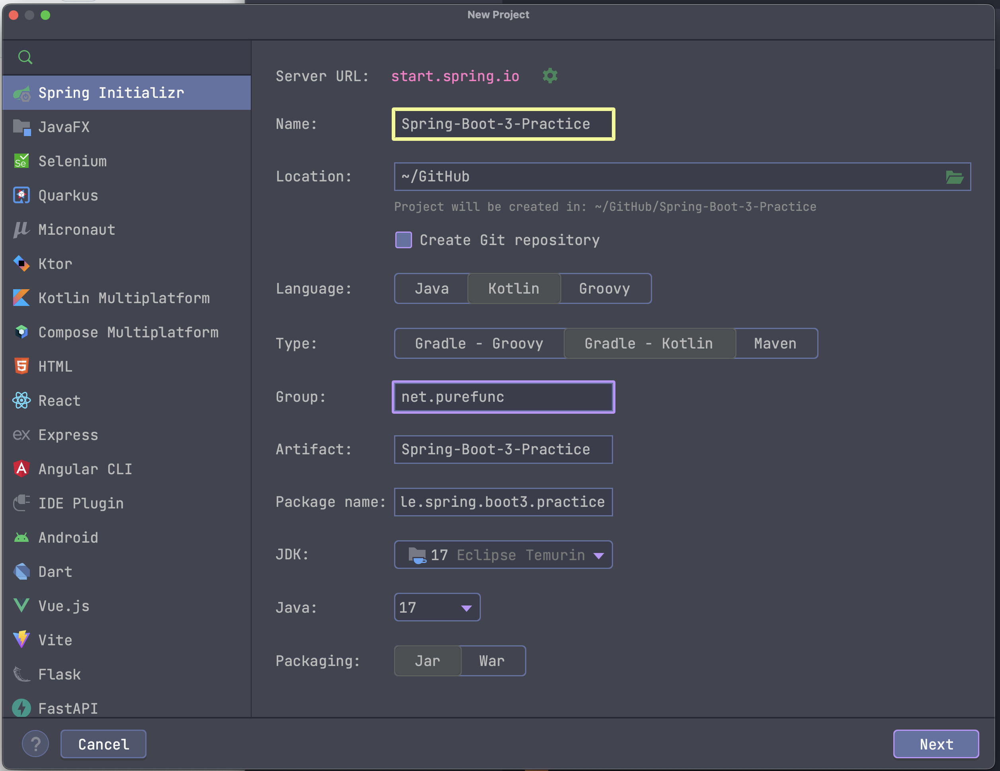

# Spring-Boot-3-Practice
* Spring Boot 3
* Spring Framework 6
* Java 17
* Kotlin 1.7
* GraalVM 22

# SDKMAN!
* https://sdkman.io/
* install Java 17, GraalVM 22
```bash
sdk list java
sdk install java $version
```


* configure
```bash
export GRAALVM_HOME=<graalvm_directory>
export PATH=${GRAALVM_HOME}/bin:$PATH
```

# New Project



# Demo Features
* records
  * https://github.com/PureFuncInc/Spring-Boot-3-Practice/blob/main/src/main/java/net/purefunc/spring/boot3/practice/java/JMemberPo.java#L14 
* text block
  * 
* switch expression, pattern matching
